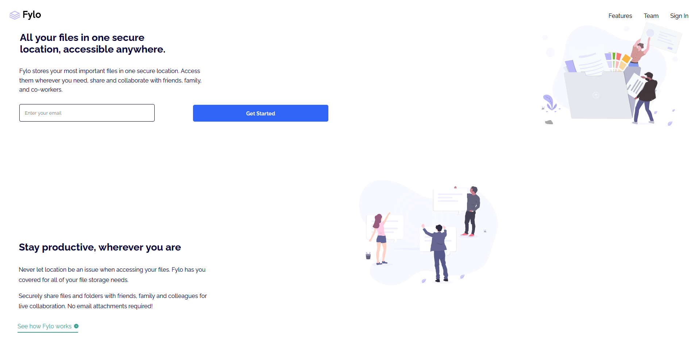

# Frontend Mentor - Fylo landing page with two column layout solution

This is a solution to the [Fylo landing page with two column layout challenge on Frontend Mentor](https://www.frontendmentor.io/challenges/fylo-landing-page-with-two-column-layout-5ca5ef041e82137ec91a50f5). Frontend Mentor challenges help you improve your coding skills by building realistic projects. 

## Table of contents

- [Overview](#overview)
  - [The challenge](#the-challenge)
  - [Screenshot](#screenshot)
  - [Links](#links)
- [My process](#my-process)
  - [Built with](#built-with)
  - [What I learned](#what-i-learned)
  - [Continued development](#continued-development)
  - [Useful resources](#useful-resources)
- [Author](#author)
- [Acknowledgments](#acknowledgments)

**Note: Delete this note and update the table of contents based on what sections you keep.**

## Overview

### The challenge

Users should be able to:

- View the optimal layout for the site depending on their device's screen size
- See hover states for all interactive elements on the page

### Screenshot




### Links

- Solution URL: [Check out the code here](https://github.com/TheCoderGuru/fylo-landing-page-with-two-column-layout)
- Live Site URL: [Add live site URL here](http://fylo-landing-page-with-two-column-layout-rouge.vercel.app/)

## My process

### Built with

- Semantic HTML5 markup
- CSS custom properties
- Flexbox
- CSS Grid
- Mobile-first workflow


**Note: These are just examples. Delete this note and replace the list above with your own choices**

### What I learned

I learnt that the best way to approach a challenge is to use the convention mobile first, as this takes away the complexity and allows for the desktop version to be easily adjusted. Secondly it is useful to visualize the design itself in components for example the navigation bar is called the navbar component which can include the website logo etc. Thirdly the usage of grid versus flexbox depends on the alignment of the content that you would like to achieve, this means that grid should only be used if content needs to be aligned on both the x and y axes.

### Continued development

I am unsure about the usage of the ```order``` property when using css flexbox hence I plan to do some more research on css flex and practice using css flexbox in my future solutions while taking into consideration the important points noted above.

### Useful resources

- [CSS Tricks - CSS Grid](https://css-tricks.com/snippets/css/complete-guide-grid/) - This helped me with the flexbox concept and I am really glad to be recommend this article, will use it going forward.

- [MDN CSS Reference](https://developer.mozilla.org/en-US/docs/Web/CSS) - This is the guide to all the css properties with an indept explanation. Definitely recommend it.


## Author

- Frontend Mentor - [@TheCoderGuru](https://www.frontendmentor.io/profile/TheCoderGuru)
- Twitter - [@TheCoderGuru](https://www.twitter.com/TheCoderGuru)

## Acknowledgments
